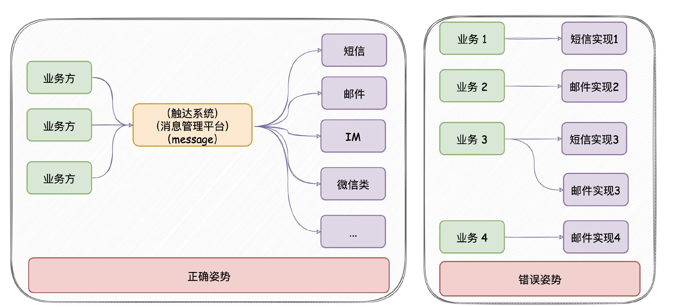
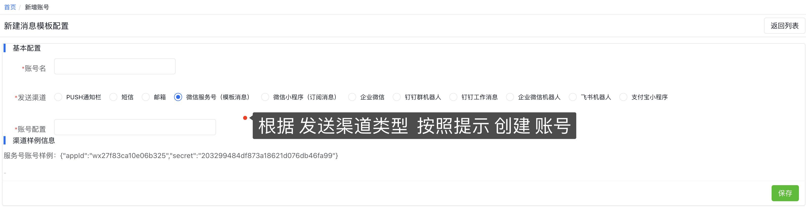
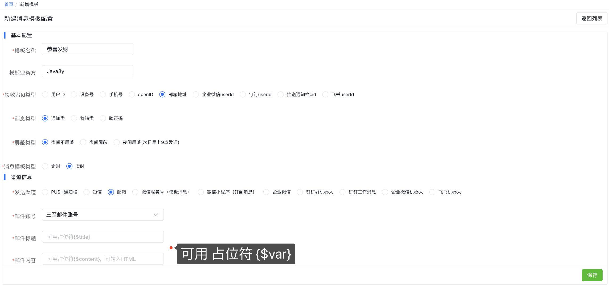
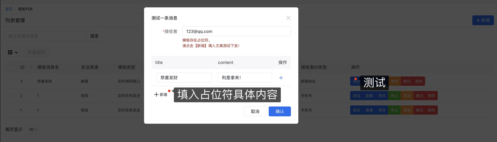
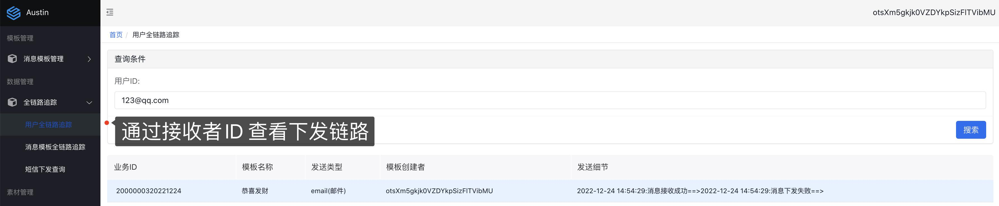
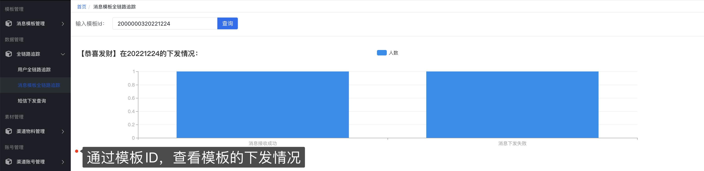
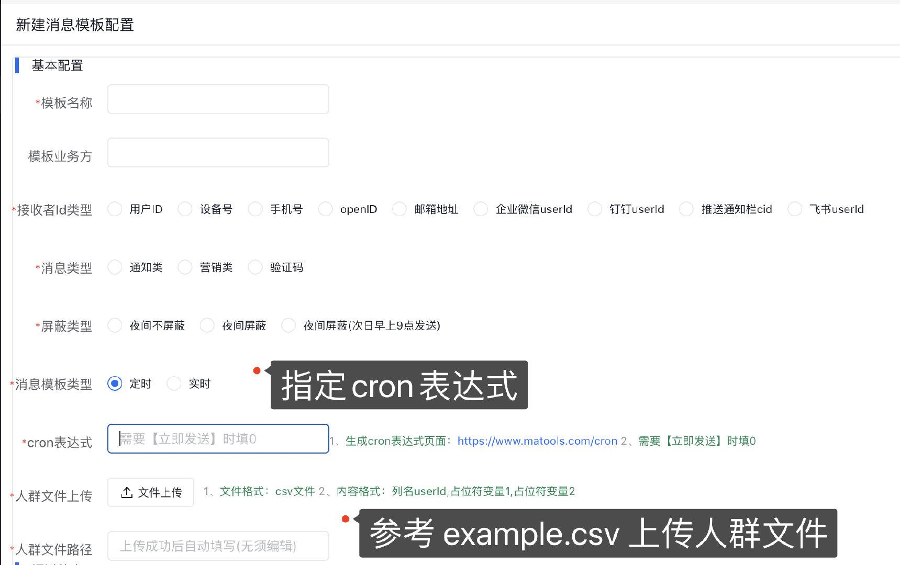

  
  
  
  
   
  
  
  
  
  
  
  
  
  
  
  
  
  
  
  
  
  
  
  
  
  
  
  
  
  

:fire:项目在线演示地址：[http://119.91.205.248:3001](http://119.91.205.248:3001)

:fire:**11W+字，共107个文档，带你玩转austin**，详情可戳：[消息推送平台文档](https://www.yuque.com/u1047901/eg5qvy/hh0gk5p4uwie8bva)

## 消息推送平台austin介绍

**核心功能**：统一的接口发送各种类型消息，对消息生命周期全链路追踪。

**意义**：只要公司内部有发送消息的需求，都应该要有类似`austin`的项目。消息推送平台对各类消息进行统一发送处理，这有利于对功能的收拢，以及提高业务需求开发的效率。

## 项目特性

**简单易用**：通过Web页面快速对接模板，操作简单，一分钟上手

**多渠道消息下发**：支持短信、邮件、微信服务号（模板消息）、微信小程序（订阅消息）、钉钉（群机器人）、钉钉（工作消息）、安卓push通知栏、企业微信(机器人消息)、企业微信（应用消息）、飞书机器人消息。

**渠道资源隔离**：不同的渠道不同的消息类型下发互不影响。例如邮件下发通道跟短信下发通道是隔离的，邮件发送缓慢不影响短信的正常发送。

**全渠道多维度消息链路追踪**：分别以用户、模板、消息的维度监控下发的过程，可准实时查看消息下发的情况。

**配置化人群定时消息下发**：上传人群文件，设置cron表达式定时下发消息。

**消息模板动态可变**：模板支持通过占位符，支持可变参数动态传入。

**高性能发送接口**：异步发送接口，支持批量发送，能支撑高并发流量。

**多渠道素材管理**：钉钉/企业微信的富文本消息需提前将素材上传至渠道平台。

**高效接入新短信渠道**：利用hades规则引擎无需系统发布上下线，即可接入新的短信渠道。

**短信流量可配置**：短信多渠道可动态配置发送到每个短信渠道的流量占比。

**消息推送平台特性**：支持消息下发文案和频次去重，夜间消息屏蔽或次日发送。

**容器化部署**：项目支持docker部署，项目相关中间件用docker-compose一键部署。

## 使用姿势

**1**、创建需要发送的渠道账号

**2**、创建消息模板

**3**、测试发送消息是否正常

**4**、查看消息下发情况

**5**、亦可在新建模板时选择**定时任务**，通过上传[csv文件](https://www.yuque.com/office/yuque/0/2022/csv/1285871/1671865125068-b5385387-b4a4-41ac-a43e-bab54ee49d88.csv?from=https%3A%2F%2Fwww.yuque.com%2Fu1047901%2Fniffsu%2Fqqtese%2Fedit)和指定cron表达式实现下发消息

## 部署姿势

austin项目**强依赖**`MySQL`/`Redis`/(**大概需要2G内存**)，**弱依赖**`kafka`/`prometheus`/`graylog`/`flink`/`xxl-job`/`apollo`/`hive`(**完全部署所有的服务，大概16G内存**)。如果缺少相关的组件可戳：[安装相关组件教程](doc/INSTALL.md)。

> 实在想要`clone`项目后不用自己部署环境直接在**本地**启动`debug`，我这提供了[股东服务](https://www.yuque.com/u1047901/eg5qvy/hh0gk5p4uwie8bva)，**直连**部署好的服务器。

**1**、austin目前使用的MySQL版本**5.7x**，如果你使用的MySQL版本8.0，注意改变`pom.xml`所依赖的版本以及对应的连接信息。

**2**、填写[application.properties](austin-web/src/main/resources/application.properties)中`spring.datasource`对应的`ip/port/username/password`信息

**3**、执行`doc/sql`文件夹下的[austin.sql](doc/sql/austin.sql)创建对应的表

**4**、填写[application.properties](austin-web/src/main/resources/application.properties)中`spring.redis`对应的`ip`/`port`/`password`信息

**5**、以上配置信息都在[application.properties](austin-web/src/main/resources/application.properties)文件中修改。(`prometheus`/`graylog`/`flink`/`xxl-job`/`apollo`/`kafka`/`hive`可选)

**6**、**austin前端管理系统部署**，戳[GitHub](https://github.com/ZhongFuCheng3y/austin-admin)或[Gitee](https://gitee.com/zhongfucheng/austin-admin)跳转至对应的仓库

**7**、（可选）正常使用**数据管理**(查看实时数据链路下发)需要将`austin-stream`的`jar`包上传至`Flink`，根据[部署文档](doc/INSTALL.md)启动Flink。在打`jar`包前需要填写`com.java3y.austin.stream.constants.AustinFlinkConstant`中的`redis`和`kafka`的`ip/port`（注意：日志的topic在`application.properties`中的`austin.business.log.topic.name`。如果没有该topic，需要提前创建，并**使用Kafka**作为消息队列实现)

**8**、（可选）正常使用**定时任务**需要部署`xxl-job`，根据[部署文档](doc/INSTALL.md)启动xxl的调度中心，并在`application.properteis`中填写  `austin.xxl.job.ip`和`austin.xxl.job.port`

**9**、（可选）正常使用**分布式日志采集**需要部署`graylog`，根据[部署文档](doc/INSTALL.md)启动`graylog`，并在`application.properteis`中填写  `austin.graylog.ip`。

**10**、（可选）正常使用**系统监控**需要部署`promethus`和`grafana`，根据[部署文档](doc/INSTALL.md)配置`grafana`图表。

**11**、（可选）正常使用**动态配置中心**需要部署`apollo`，根据[部署文档](doc/INSTALL.md)启动`apollo`，通过docker-compose启动需要在AustinApplication注入对应的ip和port(可看注释)。

**12**、（可选）正常使用**数据仓库**需要部署`hive`，根据[部署文档](doc/INSTALL.md)通过`flink`把数据写入到`hive`中（`flink`环境也要安装好），将`austin-data-house`的`jar`包提交到`flink`执行

## 官方项目交流群

austin项目官方交流群已经超过了两百人，添加我的个人微信 java3yyy 添加时备注：【**项目**】，我空的时候会拉进项目交流群里。

## 项目文档

:fire:**11W+字，共107个文档，带你玩转austin**，详情可戳：[消息推送平台文档](https://www.yuque.com/u1047901/eg5qvy/hh0gk5p4uwie8bva)

 
